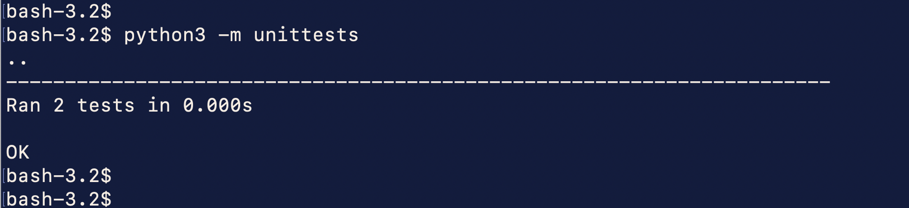
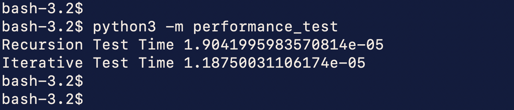

# README #

### What is this repository for? ###

This repository contains an iterative and recursive coding approach to find the shortest path between two nodes based on 
Floyd Warshall's Algorithm.

As part of Liverpool University's Mid Module Assignment, a recursive version of the algorithm is implemented.

Read more about Floyd's algorithm on below webpage:

https://www.geeksforgeeks.org/floyd-warshall-algorithm-dp-16/

### How do I get set up? ###
#### 1) For executing python files from Terminal/command line, setup environment variable 'PYTHONPATH' with below command:
	
For Mac or Linux:

export PYTHONPATH="/path/to/project/root/folder"

e.g. export PYTHONPATH="/../Documents/assignment/recursion-iteration"

#### 2) For executing code via IDE, please follow the IDE specific process of importing the project.
Generic steps:

	a. Goto 'Files' 
	
	b. Choose 'Import' or 'Open'
	
	c. Navigate to the project root folder i.e. 'recursion-iteration'
	
	d. Click 'Open'

### Running the scripts ###

#### To run scripts via command line or Terminal:
1. Navigate to the folder containing python file you want to execute.

	e.g. cd ../recursion-iteration/src/tests/
2. To execute the file, use below command:
	
	python3 -m _filename_

	e.g. $ python3 -m unittests

#### To run scripts via IDE - generic instructions:

1. Navigate to the folder containing python file you want to execute.
2. Right-click and select 'Run'

### Requirements ### 

python==3.13.2 (or higher)

### Tests

#### Unit Tests:

#### Performance Test:

